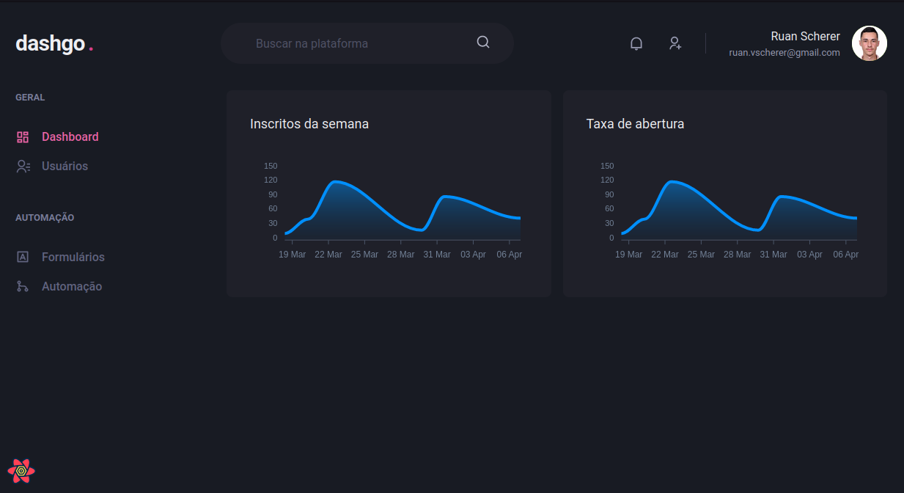
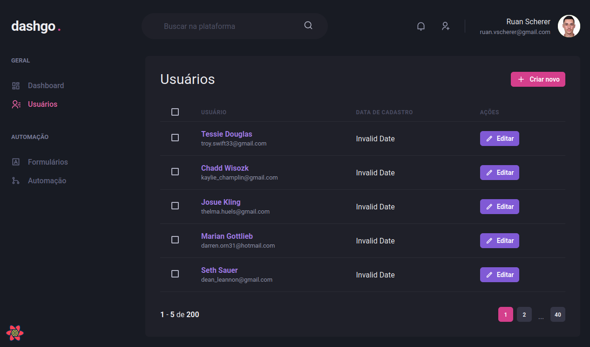
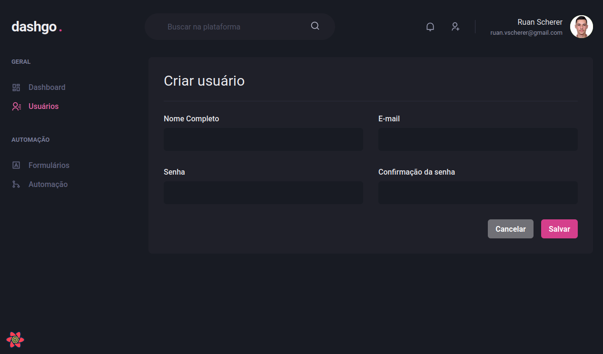

# DashGo
This is a demo dashboard. I used this project to learn and apply declarative UI and caching strategies while trying to give a better UX.

I've used [Chakra UI](https://chakra-ui.com/) to create the responsive interface and [React Query](https://tanstack.com/query/v4/docs/adapters/react-query) to implement the caching strategy.

I've also learned about form validation using [Yup](https://github.com/jquense/yup) and [react-hook-form](https://react-hook-form.com/) that was really nice!

Look at the result:

## Tech Stack
- [Next.js](https://nextjs.org/)
- [Chakra UI](https://chakra-ui.com/)
- [React Query](https://tanstack.com/query/v4/docs/adapters/react-query)
- [Yup](https://github.com/jquense/yup)
- [react-hook-form](https://react-hook-form.com/)
- [Apex Charts](https://apexcharts.com/)
- [Mirage JS (Fake API)](https://miragejs.com/)
